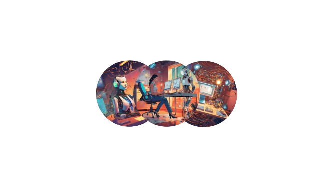

-------

 
   AnalitycsQuest: Guardiões do conhecimento!

 

 

</a>

 Ouça agora! Clicando <a href="https://spotifyanchor-web.app.link/e/d2dz57FQVKb">aqui.</a>

-------

Desafio com o objetivo de gerar um podcast utilizando ferramentas de IA através de prompts mais trabalhado.

Utilizando uma esteira de prompts para gerar cada etapa do processo criativo.

------

 > ℹ️ **NOTE:** Repositório onde desenvolvemos durante o bootcamp oferecido pela [DIO](www.dio.com.br) e instruidos pelo Felipe Aguiar

------

## 💻 Tecnologias utilizadas

- [ChatGPT](https://chat.openai.com/) - Título e conteúdo
- [Lexica.art](https://lexica.art/) - Imagens para o podcast
- [ElevenLabs](https://elevenlabs.io/) - Gravação do áudio IA
- [CapCut](https://www.capcut.com/) - Edição e adição de trilha sonora

----

## Materiais

- As imagens utilizadas estão disponíveis em `assets`
- Os áudios feitos por mim e pela ElevenLabs em `output`
- Os prompts utilizados estão em `prompts`

----

## ⚙️​ Desenvolvimento

- Roteiro gerado via chatgpt
- Por mim e pela elevenLabs
- Lexica.art Para gerar capas
- Capcut para tratar aúdio e adicionar sons de fundo

-----

👍​ Gostou? Conecte-se comigo: [Linkedin](https://linkedin.com/in/ana-meliti/)
